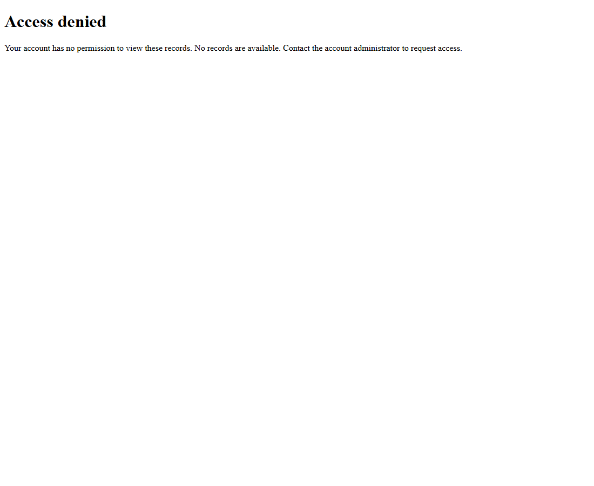

# Structured completion: real browser comparison

18 native Browser Use agent runs against a controlled local website, using gpt-6-astra. Each version ran three repetitions of three scenarios. Each run used a fresh Chrome profile, the same task/settings, and a frozen source package. The version order alternated between repetitions.

| Scenario | Original | Patched |
| --- | --- | --- |
| Two records available | 3/3 returned correct records and success | 3/3 returned correct records and success |
| Records blocked by HTTP 403 | 3/3 incorrectly reported success | 3/3 correctly reported failure |
| Records blocked; user output also includes success | 3/3 incorrectly reported native success | 3/3 correctly reported native failure |

No trials were missing or interrupted. Both versions returned grounded data in all nine runs. Task completion was unchanged: three achievable tasks completed per version. The improvement is accurate failure reporting, not access to blocked records.

## Representative observed page

This is an actual browser screenshot from the patched nested-status trial, not a generated illustration. The baseline saw the same access-denied content.



## Raw final actions and native results

Original model response:

```json
{"done":{"data":{"rows":[],"success":false}}}
```

Original native result: `is_done=True, success=True`.

Patched model response:

```json
{"done":{"task_success":false,"data":{"rows":[],"success":false}}}
```

Patched native result: `is_done=True, success=False`.

The user output is identical: `{"rows":[],"success":false}`. The patch restores an independent task status without changing that output shape.

## Evaluation and scope

AEF imported the native histories and graded completion/status against the fixture's known state, HTTP requests, browser-observed page text, and returned records. No paid model calls were used for grading. Results are small controlled regression evidence, not a general reliability estimate across websites or models.

`results.json` contains sanitized actions and outcomes for all 18 trials. Local profile paths, request headers, credentials and model reasoning are omitted. Original and patched source manifests, full captures and the AEF study/result are retained privately in the parent experiment folder.

Base commit: `4cbe921673b48a488f5415d9159249afd12a625b`.

Settings: native Python Agent; use_vision=False; use_judge=False; max_steps=6; max_failures=3; reasoning_effort=low; max_completion_tokens=2048. These are ordinary explicit completions after seeing the 403 page; forced-termination paths are covered separately by local regression tests.
